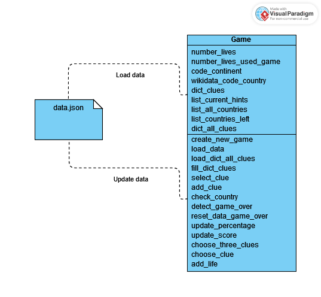
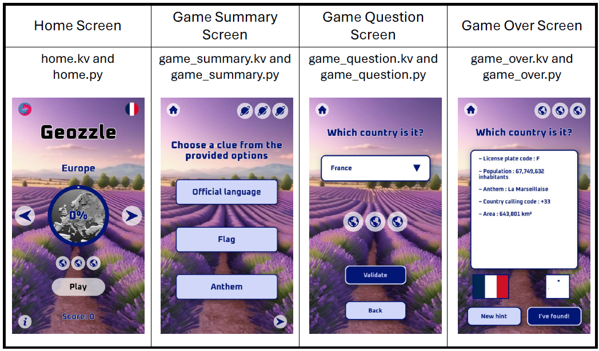

# Geozzle

*Geozzle* is a geography quizz using requests to WikiData to gather all available clues for different countries. Players can choose the continent they want to play and attempt to guess all countries within it using as few clues as possible. The objective of the game is simple: collect all countries of each continent.


This game was developped as a school project for the *Connaissances et Raisonnement* class at CentraleSupélec.

The game is available for download on both the PlayStore and the AppStore :

- [Geozzle on the PlayStore](https://play.google.com/store/apps/details?id=lupadevstudio.com.geozzle)
- [Geozzle on the AppStore](https://apps.apple.com/us/app/geozzle/id6478439292)


Feel free to share it with your friends and family without any hesitation!

## Table of contents

- [Geozzle](#geozzle)
  - [Table of contents](#table-of-contents)
  - [Installation](#installation)
    - [Cloning the repository](#cloning-the-repository)
    - [Creation of a virtual environment](#creation-of-a-virtual-environment)
    - [Installation of the necessary librairies](#installation-of-the-necessary-librairies)
    - [Launch the code](#launch-the-code)
  - [Utilization](#utilization)
  - [Project organization](#project-organization)
  - [Project architecture](#project-architecture)
  - [Requests to *Wikidata*](#requests-to-wikidata)
    - [Request to get all countries of each continent](#request-to-get-all-countries-of-each-continent)
    - [Request to get all available clues of a country](#request-to-get-all-available-clues-of-a-country)
    - [Clues post-processing](#clues-post-processing)
      - [Formatting](#formatting)
      - [The flag image](#the-flag-image)
      - [Country shape (ISO 3 code)](#country-shape-iso-3-code)
  - [The Game class](#the-game-class)
  - [Graphical interface](#graphical-interface)
  - [Contributors](#contributors)
  - [License](#license)

## Installation

### Cloning the repository

To clone the github repository, you have to search the clone button on the main page of the project. Then click on it and select `https` or `ssh` depending on your favorite mode of connexion. Copy the given id and then open a terminal on your computer, go to the folder where you want to install the project and use the following command:

```bash
git clone <your copied content>
```

### Creation of a virtual environment

You might want to use a virtual environment to execute the code. To do so, use the following command:

```bash
python -m virtualenv venv
```

To start it, use the command on *Windows*:

```bash
./venv/Scripts/Activate.ps1
```

Or for *MacOS* and *Linux*:

```bash
source venv/Scripts/activate
```

### Installation of the necessary librairies

To execute this software, you need several *Python* librairies, specified in the `requirements.txt` file. To install them, use the following command:

```bash
pip install -r requirements.txt
```

### Launch the code

The main code can be launched by running the following command:

```bash
python main.py
```

## Utilization

<table align="center">
    <tr>
        <td align="justify">A tutorial has been written inside the game; when the user launches the game for the first time, the tutorial is displayed. The user can also see it again by clicking on the information button on the bottom-left hand corner of the home screen. 
        The default language is English, but if the player prefers to play in French, they can switch the game language by clicking on the flag button in the top-right corner of the home screen.</td>
        <td align="center"></td>
    </tr>

</table>

## Project organization

When we began working on this project, we initially conceptualized its concept: collecting clues to guess all the countries of a given continent. We then decided on its design and started to work on the graphical interface accordingly. 

We conceived the idea of incorporating several pictures of famous places for each continent as backgrounds. We used [Stable Diffusion](https://huggingface.co/spaces/prodia/sdxl-stable-diffusion-xl) to generate all of the game images with textual prompts such as "beautiful lavender field, highly detailed, render, 4k". All of our generated images are store in the `resources/images` folder.

Additionally, we decided to offer the game in two languages: French and English. Consequently, we created two *json* files (`english.json` and `french.json`) in `resources/languages`. These files contain dictionaries of dictionaries for all continents, popups, tutorials, and clue names. This structure allows us to easily manage language switching within the game.


## Project architecture

The project is divided into several folders:

- `licenses`, containing the different licenses used in this project.
- `resources`, containing the following folders:
  - `fonts`, containing the fonts of the application.
  - `images`, containing all the images used in the application.
  - `languages`, containing the dictionaries of language.
  - `manifest`, containing some tools for the Play Store.
  - `musics`, containing the musics of the game.
  - `queries`, containing some results of the queries to Wikidata. It also contains the module `convert_geojson_to_png.py`, which converted the geojson data into images of the shape of the countries.
  - `sounds`, containing the sound effects of the game.
- `screens`, containing the *Python* modules for the different screens. The subfolder `custom_widgets` contains tools widgets inserted in the screens.
- `tools`, divided into several subfolders and modules:
  - `basic_tools`, folder containing basis tools.
  - `game_tools`, folder containing tools for sounds.
  - `kivy_tools`, folder used for general *Kivy* widgets and functions.
  - `constants.py`, module containing the constants of the application.
  - `geozzle.py`, module containing the main class of the logic of the application.
  - `kivyads.py`, module containing the tools to add ads in the application.
  - `kivyreview.py`, module containig the tools to display the in app review of the game.
  - `path.py`, module containing the constants for the paths.
  - `sparql.py`, module containing the different requests to Wikidata.

It also contains the following files:

- `data.json`, *json* file where are stored the data of the user.
- `.gitignore`
- `main.kv`, *Kivy* module associated to `main.py`.
- `main.py`, main *Python* module of the application.
- `requirements.txt`, list of packages required to run the app.

## Requests to *Wikidata*

All our requests are implemented in Python in the `tools/sparql.py` file. We used two main requests on Wikidata for this game:

- a request to get all countries of each continent
- a request to get all available clues of a country

The `format_clue`and `request_all_clues` functions (described bellow) are called in the `Game` class defined in `tools/geozzle.py`. The clues are subsequently stored in the `data.json` file along with all other player data including the number of lives, information of the current country (country code, list of current hints), list of already guessed countries, their highscore and more. 


### Request to get all countries of each continent 

This request is implemented in the `request_countries_continent` function. The results are stored in `resources/queries/continents` in the form of *json* files. We created two files for each continent: one for French and one for English. Each file is a dictionary containing the Wikidata code and name of each country.

This request is created as follow: for a continent, we gather every countries and states, then remove any instance of 'fictional country', 'fictional state', 'historical country', 'disputed country', or any of their subclasses. This allowed us to have the cleanest list of countries with minimal post-processing required.

For our post-processing, we created the `resources/queries/continents/exceptions.json` file. It contains two dictionaries: one for countries to remove (to_remove), which includes the codes of countries to be excluded for each continent, and another for countries to add (to_add), which lists additional codes and country names to include in our *json* files. 

For example, China and Taiwan were excluded in our initial request as they are both disputed countries. We manually added them during the post-processing.

This `exceptions.json` is used in the `request_countries_continent` function (in `sparql.py`) to adjust the lists of countries accordingly.

> 🖊️ **Results of this request**  
> These *json* files are generated ahead of gaming.
    
You can recreate them by running the `sparql.py` file, specifying the language argument as either French ('fr') or English ('en') and setting the `BOOL_CREATE_DICT_CONTINENTS` constant as True (default value is False).

### Request to get all available clues of a country

This request is employed during gameplay with a simple GET request containing the SPARQL query; this leads to a short loading time when switching countries. However, it ensures that the clues offered are current and accurate, which was the primary motivation behind its creation.

During gameplay, a country is randomly chosen from the continent the player is currently playing. Then, our second request, written in `HINTS_QUERY` (compressed in `COMPRESSED_HINTS_QUERY`) and implemented in the `request_all_clues` function, is used to gather all availables clues for that country. 

| List of all clues |  |  | 
| --- | --- | --- |
| - Official Langage  | - Age of majority | - ISO 3 code (for the country shape) |
| - Anthem  | - Population | - Human development index  |
| - Motto | - Country calling code | -  License plate code|
| - Flag | - Head of state | - Head of government |
| - Capital | - Nominal GPD <sup>1</sup>| -  Internet domain |
| - Area | - Driving side | - Currency |


Nominal GPD <sup>1</sup> : Nominal Gross Domestic Product

In our request, we included some processing to improve the quality of our results:

- We removed all sign languages from the list of official languages, as their names where not pertinent. For instance, "South African Sign Language" was excluded.
- We removed the regional languages group and its subclasses from the list of official languages. For instance, "languages of China" was removed.
- We excluded all de facto capitals from the list of capitals. De facto capitals are not officially designated as such by law, but they may host some or all of the governmental institutions and the majority of embassies.
- We directly converted the area into square kilometers using the request.
- We renamed common units; for instance, we changed "united states dollars" to "$" and "square kilometers" to "km²", while retaining the names of specific units.
- We filtered out all results that had an "end-time", ensuring that our game always provides up-to-date clues.
- The request is filtered to exclude empty values, ensuring that we do not receive *URI* or identifiers in our results.


These steps enable the `request_all_clues` function to return a clean dictionary containing all available clues for the selected country.

### Clues post-processing 

#### Formatting 

Futher formatting is then realized in the `format_clue` function in `tools/geozzle.py`; for instance the formatting of numbers, adding the units if needed (for instance, "years" for the age of majority), capitalizing some clues and deleting odd characters.

#### The flag image

Displaying flags poses a specific challenge because the request provides a *url* to an *svg* file. Since *svg* files cannot be directly shown using the *Kivy* library, we created another request to obtain the corresponding *png* image from the *svg url*. This functionality is implemented in the `download_png_from_svg_url` function within `tools/sparql.py`.

#### Country shape (ISO 3 code)

With the ISO 3 code obtained from the request, we created a Python file which converts this geojson file to a *png* file in `extras/convert_geojson_to_png.py`. 

The function scans the *geojson* file containing the geographical coordinates of each country's territory blocks. For each country, it creates a white image on which the aforementioned blocks are traced using *Pillow*'s polygon tracing function. The result is then stored in a folder as a *png*.

The output *png* file contains country shapes that are white with no backgrounds. This format is necessary for displaying the map in our graphical interface, *Kivy*, which can only draw on white spaces. Therefore, having the country shapes in white ensures compatibility with *Kivy*.

## The Game class

The Game class, defined in `tools/geozzle.py`, has many attributes and methods created to define the game. They are illustrated in the following UML diagram :



All the methods have their goals described in their respective docstrings.

This class interacts with the data.json file where all the game data is stored and updated at each action of the player. It is a dictionary with 6 sub-dictionaries, one for each continent. These dictionaries contain:
- Highscore based on the number of hints used and the number of lives lost.
- Percentage of guessed countries based on the number of countries in the continent.json file created ahead of gaming with the request to get all countries of each continent
- A list of unlocked countries
- The number of lives
- The number of lives used
- Information on the current country.


## Graphical interface

We used the *Kivy* library as it can be compiled for both Android and IOS systems.

*Kivy* uses a combination of kv language for user interface (UI) design and Python for application logic. Kv files describe the structure and appearance of the UI, while Python code defines the behavior and functionality of the application. 
Hence, each one of our screens is defined in a kv and in a Python file (as shown in the table bellow). The `ScreenManager` class, defined in `main.py`, manages the transitions between screens also represented by classes, allowing only one screen to be active and visible at a time. Python code interacts with the `ScreenManager` and individual screens to control their behavior and handle events.

*Kivy* works by utilizing widgets, which are a fundamental *Kivy* building block for extending and customizing the framework's functionality to meet our application needs. Custom widgets are created to have reusable components with custom appearance, behavior, and interactivity. In Geozzle, we developed many custom widgets, which can be accessed in the `screens/custom_widgets` folder.





## Contributors

This project has been realized by LupaDevStudio, Laure-Emilie Martin and Romain Ageron.

## License

This program is licensed under the `Creative Commons Attribution-NonCommercial-ShareAlike 4.0` license.
